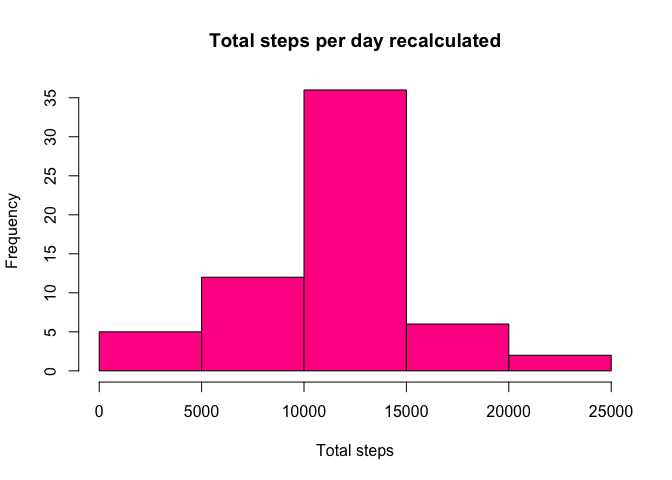

This assignment makes use of data from a personal activity monitoring device. This device collects data at 5 minute intervals through out the day. The data consists of two months of data from an anonymous individual collected during the months of October and November, 2012 and include the number of steps taken in 5 minute intervals each day.

1. Code for reading in the dataset and/or processing the data

## Loading and preprocessing the data

```r
if (!file.exists('activity.csv')) {
  unzip(zipfile = "activity.zip", overwrite=TRUE)
}

activityData <- read.csv(file="activity.csv", header=TRUE)
```

The dataset is stored in a comma-separated-value (CSV) file and there are a total of 17,568 observations in this dataset. The file is unzip, read and assigned to the data frame activityData.

##Histogram of the total steps

2. Histogram of the total number of steps taken each day


```r
totalSteps <- aggregate(steps~date, activityData, FUN = sum)
```

Total steps are calculated by adding all the data of steps taken from the same day.


```r
hist(totalSteps$steps, main= "Total steps per day", col = "darkorchid1", border="black", xlab="Total steps")
```

<!-- -->

A histogram of the steps calculated is created. 

## What is mean and median number of steps taken per day?

3. Mean and median number of steps taken each day


```r
meanSteps <- mean(totalSteps$steps)
medianSteps <- median(totalSteps$steps)
print( c("Mean steps daily:", meanSteps, "Median steps daily:", medianSteps))
```

```
## [1] "Mean steps daily:"   "10766.1886792453"    "Median steps daily:"
## [4] "10765"
```

The mean steps daily is 10766,19
The median steps daily is 10765

## What is the average daily activity pattern?

4. Time series plot of the average number of steps taken.


```r
timeSeriesSteps <- aggregate(steps~interval, activityData, FUN = mean)

plot(timeSeriesSteps$interval, timeSeriesSteps$steps, type = "l", xlab = "5-minute interval", ylab = "Average steps", main = "Average steps per day by time intervals")
```

<!-- -->

5. The 5-minute interval that, on average, contains the maximum number of steps


```r
timeSeriesSteps[which.max(timeSeriesSteps$steps),]
```

```
##     interval    steps
## 104      835 206.1698
```
The 5-minute interval that, on avergae, contains the maximum number of steps is interval 835, with 206.17 steps. 

## Imputing missing values

6. Code to describe and show a strategy for imputing missing data

First I evaluate the amount of missing data. 

```r
missingValuesSteps <- is.na(activityData$steps)
missingValuesDate <- is.na(activityData$date)
missingValuesInterval <- is.na(activityData$interval)

c("missing values steps:",sum(missingValuesSteps==TRUE))
```

```
## [1] "missing values steps:" "2304"
```

```r
c("missing values dates:",sum(missingValuesDate==TRUE))
```

```
## [1] "missing values dates:" "0"
```

```r
c("missing values intervals:",sum(missingValuesInterval==TRUE))
```

```
## [1] "missing values intervals:" "0"
```

There are 2304 missing values in steps data. For imputing missing data, a new data set equal to the original will be created, then all the average values per interval will be added to the missing data in the new data set.


```r
activityCorrected <- activityData

for (i in 1:nrow(activityCorrected)) {
    if (missingValuesSteps[i] ==TRUE ) 
     { 
     activityCorrected$steps[i] <- timeSeriesSteps$steps[match(activityCorrected$interval, timeSeriesSteps$interval)[i]]
    }
 }
```

7. Histogram of the total number of steps taken each day after missing values are imputed

A histogram of the total number of steps taken each day and the mean and median total number of steps taken per day is recalculated.


```r
newTotalSteps <- aggregate(steps~date, activityCorrected, FUN = sum)
hist(newTotalSteps$steps, main= "Total steps per day recalculated", col = "deeppink", border="black", xlab="Total steps")
```

<!-- -->


```r
meanNSteps <- mean(newTotalSteps$steps)
medianNSteps <- median(newTotalSteps$steps)
print( c("Mean steps daily recalculated:", meanSteps, "Median steps daily recalculated:", medianSteps))
```

```
## [1] "Mean steps daily recalculated:"   "10766.1886792453"                
## [3] "Median steps daily recalculated:" "10765"
```

```r
diffMean = meanNSteps - meanSteps
diffMedian = medianNSteps - medianSteps
diffTotal = sum(newTotalSteps$steps) - sum(totalSteps$steps)
print( c("Difference in mean:", diffMean, "Difference in Median:", diffMedian, "Difference in Total steps:", diffTotal))
```

```
## [1] "Difference in mean:"        "0"                         
## [3] "Difference in Median:"      "1.1886792452824"           
## [5] "Difference in Total steps:" "86129.5094339623"
```

The histogram changes the frequency. The impact of imputing missing data on the estimates of the total daily number of steps affects the frequency directly. There's a change in median of 1.189, and in total steps of 86129.51.

## Are there differences in activity patterns between weekdays and weekends?

8. Panel plot comparing the average number of steps taken per 5-minute interval across weekdays and weekends

First, a new factor variable in the dataset with two levels – “weekday” and “weekend” is created. For this part the 
weekdays() function is used with the dataset containing filled-in missing values.

```r
dayType <- function(date) {
    dtype <- weekdays(date)
    if (dtype %in% c('Monday', 'Tuesday', 'Wednesday', 'Thursday', 'Friday'))
        return ("weekday")
    else if (dtype %in% c('Saturday', 'Sunday'))
        return ("weekend")
}

activityCorrected$date <- as.Date(activityCorrected$date)
```

Second, the column assigning the day type is assigned to a new data frame containing the average steps by interval.


```r
activityCorrected$day <- sapply(activityCorrected$date, FUN = dayType)
averageStepsCorrected <- aggregate(steps~interval+day, activityCorrected, FUN = mean)
```

Then, a panel plot is constructed, containing a time series plot of the 5-minute interval (x-axis) and the average number of steps taken, averaged across all weekday days or weekend days (y-axis).


```r
averageWeekend <- subset(averageStepsCorrected, averageStepsCorrected$day=="weekend")
averageWeekday <- subset(averageStepsCorrected, averageStepsCorrected$day=="weekday")

library(ggplot2)

ggplot(data = averageStepsCorrected, aes(x = interval, y = steps))+ geom_line() + ggtitle("Average steps by interval") + xlab("5-minute interval") + ylab("Average steps") + facet_grid(day ~ .)
```

<!-- -->

9. All of the R code needed to reproduce the results (numbers, plots, etc.) in the report
